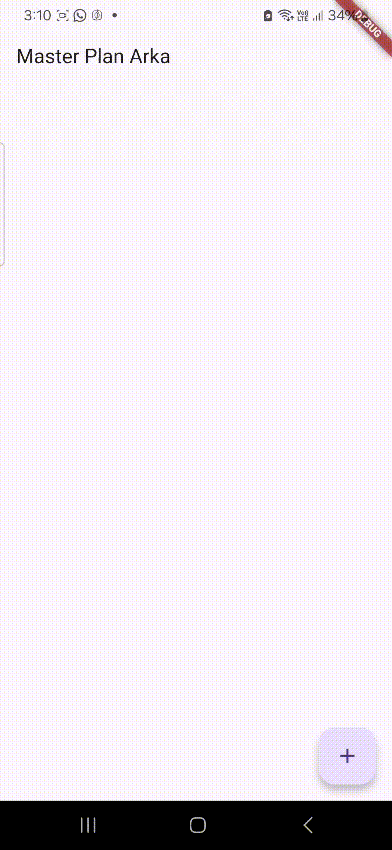
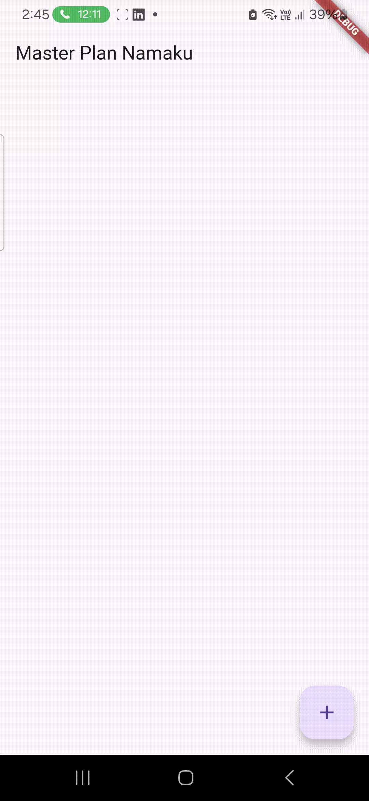
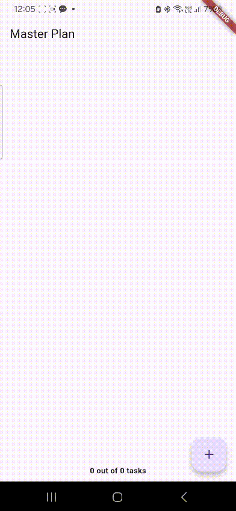
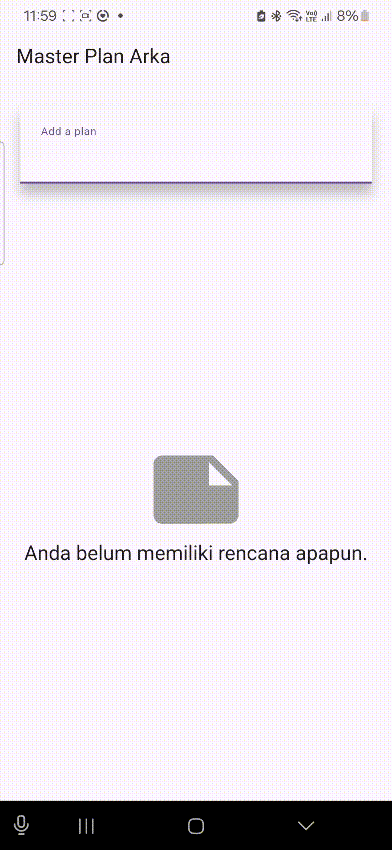

# Practical 1: Basic State with Model-View

### 1. Complete the lab steps, then document the final results with a GIF and explanation in the file README.md! If you find any errors or issues, please fix them.



In this exercise, information is managed directly within PlanScreen through a local variable called plan. Whenever users create a new task, the list gets refreshed in the local state by calling setState().

**Final Result**

Users can create tasks via the FloatingActionButton, and these tasks appear in a single plan list.
* Everything is maintained within one screen's local state.
* When the application restarts, all information disappears since no persistent data management has been set up.
* The model and view components haven't been separated yet at this point.

### 2. Explain the purpose of step 4 in the practicum! Why is this done?

This phase establishes the data structure representing an individual task in the master plan, such as learning objectives or action items. Creating this class (like Plan or Task) enables the application to:
* Hold both the title and completion status of each plan entry.
* Handle the plan collection effectively (including addition, modification, and removal).
* Distinguish between data representation (model) and user interface (view), adhering to MVC or MVVM architecture in Flutter.

### 3. Why is the plan variable needed in step 6 of the lab? Why is it a constant?

The `plan` variable holds the complete collection of Task or Plan objects that make up the user's master plan.
```dart
final List<Plan> plan = [];
```

**Function**

This collection stores every plan entry created by users.  
It enables the interface to show the plan list and dynamically update their states (marked or unmarked) as users interact with the application.

**Why It's Declared as final**

Using `final` ensures that the list reference itself stays unchanged, though its elements can be modified (like adding or removing entries).

This offers two important benefits:
1. It safeguards against accidental reassignment of the list reference.  
2. It maintains a stable internal structure while permitting content modifications.

Essentially, the list location in memory stays fixed, but the information within can change based on user interactions.

### 4. Capture the results of Step 9 as a GIF, then explain what you have created!



The GIF showcases the functional Master Plan application. Users can browse tasks, toggle their completion status, and create new entries instantly through Flutter's stateful widget mechanism.

### 5. What is the use of the methods in Steps 11 and 13 in the lifecycle state?

* initState() serves to retrieve existing plans or set up variables during initialization.
* dispose() ensures proper cleanup of the TextEditingController to avoid memory leaks.

### 6. Submit your practicum report in the form of a commit link or GitHub repository to the agreed lecturer!
----

# Practical 2: InheritedWidget

### 1. Complete the lab steps, then document the final results with a GIF and explanation in the file README.md! If you find any errors or issues, please fix them.

### 2. Explain what is meant InheritedWidgetby step 1! Why is it used InheritedNotifier?

**InheritedWidget**

InheritedWidget serves as a core Flutter component that enables data or state distribution throughout the widget hierarchy without repeatedly passing it via constructors.
It's typically employed for straightforward state management.
Child widgets can observe data modifications from the InheritedWidget and refresh automatically upon changes. Nevertheless, a standard InheritedWidget triggers a complete widget tree rebuild on every data change, which becomes inefficient for frequently modified data.

**InheritedNotifier**

InheritedNotifier represents a specialized version of InheritedWidget integrated with ChangeNotifier.
It refreshes exclusively the widgets that observe the notifier when modifications happen.
This approach proves significantly more efficient for rapidly changing data, including counters, collections, or form fields.

### 3. Explain the purpose of the method in step 3 of the practicum! Why is this done?

This method simplifies data access from the InheritedWidget for other widgets, eliminating the need to instantiate it repeatedly.

The of(context) function serves as a centralized access mechanism (similar to a global getter) for shared data within the widget hierarchy.

This approach enables widgets to retrieve data from the InheritedWidget through BuildContext effortlessly, and automatically refresh when the shared data undergoes changes.

### 4. Capture the results of Step 9 as a GIF, then explain what you have created!



The completed application shows a counter that responds to increment and decrement button presses. State management is handled through an InheritedNotifier, which optimally refreshes only dependent widgets when the counter changes. This illustrates how InheritedNotifier enables responsive and efficient state management without requiring external packages.

### 5. Submit your practicum report in the form of a commit link or GitHub repository to the agreed lecturer!
----

# Practical 3: State in Multiple Screens

### 1. Complete the lab steps, then document the final results with a GIF and explanation in the file README.md! If you find any errors or issues, please fix them.

### 2. Based on the Practical 3 that you have done, explain the meaning of the following diagram!

The diagram depicts the widget structure and state management flow in the Master Plan application following the implementation of lifted state using an InheritedWidget (particularly InheritedNotifier), enabling state sharing between multiple screens. This visualization shows how Flutter effectively handles global state across various screens using InheritedNotifier, independent of external state management solutions like Provider or Riverpod.

**Main Page (PlanCreatorScreen)**

* MaterialApp
The foundation widget managing themes, navigation, and screen transitions throughout the app.

* PlanProvider
An InheritedNotifier maintaining global state as a List<Plan>.
Every widget beneath it can retrieve and update the plan collection without explicit data passing through constructors (preventing prop drilling).

* PlanCreatorScreen
The initial screen showing all available plans and enabling users to create new entries.

* Column
Stacks widgets in vertical arrangement, containing a TextField and plan collection (Expanded → ListView).

* TextField
Input component for creating new plans.

* Expanded → ListView
Shows all current plans.
Tapping a plan initiates navigation via Navigator.push() to display the detail screen (PlanScreen).

**Navigator Push**

The "Navigator Push" connection in the diagram's center indicates screen transitions from PlanCreatorScreen to PlanScreen.
The chosen plan information passes through the PlanScreen(plan: plan) constructor.

**Plan Detail Page (PlanScreen)**

* MaterialApp
Remains within the identical app framework.

* PlanScreen
Shows comprehensive information for the chosen plan, including its task collection.

* Scaffold
Delivers the primary page structure, encompassing AppBar, body, and FloatingActionButton.

* Column
Organizes content vertically, presenting the task collection and progress overview beneath.

* Expanded → ListView
Houses the task collection with interactive Checkbox and TextFormField components for checking or modifying tasks.

* SafeArea → Text
Shows completion metrics (such as "3 out of 5 tasks complete") at the screen bottom.

### 3. Capture the results of Step 14 as a GIF, then explain what you have created!



This exercise implements the **Lift State Up** principle, allowing data accessibility and sharing between multiple screens. It employs an **InheritedNotifier** (`PlanProvider`) to maintain the global `List<Plan>` and establish connections between different pages. The implementation features two primary screens: **PlanCreatorScreen**, presenting all plans and enabling creation of new entries, and **PlanScreen**, displaying selected plan details and associated tasks. Screen transitions utilize `Navigator.push()`, transferring the selected plan as a parameter to ensure both screens operate with identical state.

### 4. Submit your practicum report in the form of a commit link or GitHub repository to the agreed lecturer!